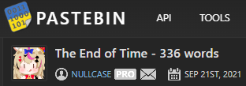
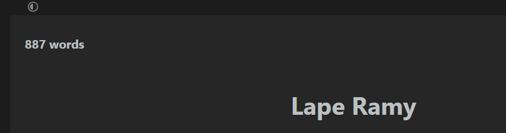
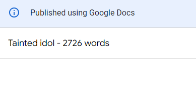
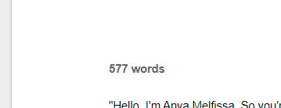

# WordCounter Chrome Extension
 Simply counts the words in documents on Google Docs, Pastebin, Rentry, and Gdocs, and displays the count in the title.

 The "algorithm" is super basic and counts everything between whitespaces as a word. Basically how Microsoft Word does it.

## How to install
### If Chrome:
1. Download/Clone the repo
2. Go to [Manage Extensions](chrome://extensions) in Chrome
3. Click `Load unpacked` (enable `Developer Mode` if you haven't yet)
4. Select the root folder of the extension
5. Might need to enable the extension or click `Update`, idk
### If not Chrome:
The code is right there, just reimplement it for your browser of choice or whatever

## Screenshots
### Pastebin

### Rentry

### Google Docs

### GDocs

